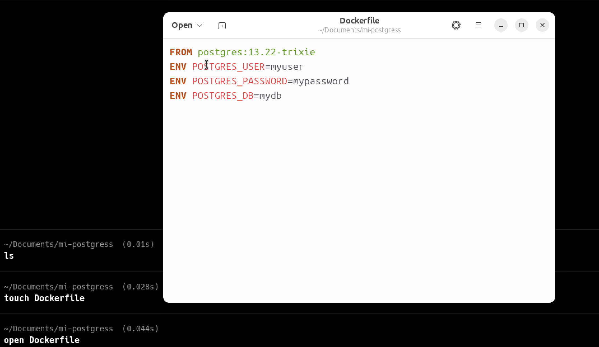
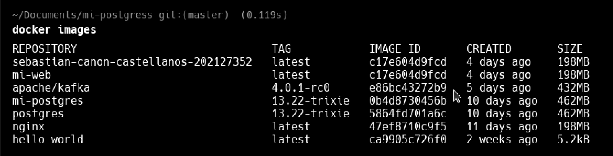

# Práctica de Docker con PostgreSQL

## Introducción

Esta práctica tiene como objetivo demostrar el uso de Docker para crear y gestionar contenedores de bases de datos PostgreSQL. Se desarrolló un proceso completo que incluye la creación de un Dockerfile personalizado, la construcción de una imagen Docker basada en PostgreSQL versión 13.22-trixie, el despliegue de un contenedor y la verificación de conectividad a la base de datos.

## Desarrollo de la Práctica

### 1. Creación del Dockerfile

Se creó un Dockerfile basado en la imagen oficial de PostgreSQL versión 13.22-trixie, configurando las variables de entorno necesarias para el usuario, contraseña y nombre de la base de datos.

El Dockerfile define:
- **FROM postgres:13.22-trixie**: Imagen base oficial de PostgreSQL
- **ENV POSTGRES_USER=myuser**: Usuario de la base de datos
- **ENV POSTGRES_PASSWORD=mypassword**: Contraseña del usuario
- **ENV POSTGRES_DB=mydb**: Nombre de la base de datos inicial

### 2. Descarga de la Imagen Base

Comando ejecutado: `docker pull postgres:13.22-trixie`

Este comando descarga la imagen oficial de PostgreSQL desde Docker Hub, asegurando que tengamos la versión específica requerida.

### 3. Construcción de la Imagen Personalizada

Comando ejecutado: `docker build -t mi-postgres:13.22-trixie .`

Se construyó exitosamente la imagen personalizada con el tag `mi-postgres:13.22-trixie`, incorporando las configuraciones del Dockerfile.

### 4. Verificación de Imágenes Disponibles

Comando ejecutado: `docker images`

La imagen se creó correctamente y aparece listada en el repositorio local de Docker con el tag especificado.

### 5. Ejecución del Contenedor

Comando ejecutado: `docker run -d --name mi-contenedor-postgres -p 5432:5432 mi-postgres:13.22-trixie`

Se ejecutó el contenedor en modo detached (-d) con mapeo del puerto 5432 del host al puerto 5432 del contenedor, permitiendo el acceso externo a la base de datos.

### 6. Verificación del Estado del Contenedor

Comando ejecutado: `docker ps`

Se confirmó que el contenedor está ejecutándose correctamente, mostrando el estado "Up" y el mapeo de puertos correspondiente.

### 7. Resultados de la Ejecución

Se verificó el correcto funcionamiento del contenedor y sus configuraciones.

### 8. Conexión a la Base de Datos

Comando ejecutado: `docker exec -it postgres-perzonalizado psql -U myuser -d mydb`

Se estableció exitosamente la conexión a la base de datos PostgreSQL dentro del contenedor, utilizando las credenciales configuradas en el Dockerfile. Esto confirma que:
- El contenedor está funcionando correctamente
- Las variables de entorno se aplicaron apropiadamente
- La base de datos está operativa y accesible

Todos los pasos fueron documentados con capturas de pantalla que evidencian la correcta ejecución de cada comando y el cumplimiento de los objetivos de la práctica. El entorno de base de datos PostgreSQL está completamente funcional y accesible a través del contenedor Docker creado.
